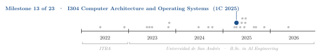
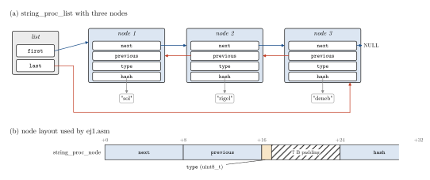
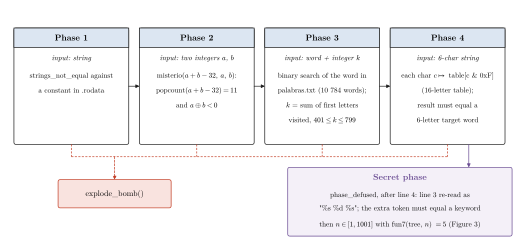
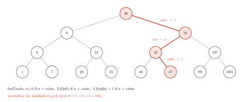

<div align="center">

# Linked Lists in x86-64 Assembly and Reverse Engineering a Binary Bomb

**Santiago Groba Alonso**

Universidad de San Andrés · *I304 Computer Architecture and Operating Systems* · First semester 2025 · Assignment 2

[](#reproducing-the-results)
[](#reproducing-the-results)

<picture>
  <source media="(prefers-color-scheme: dark)" srcset="docs/figures/trajectory-dark.svg">
  
</picture>

</div>

> **Abstract.** The assignment has two halves that meet at the System V x86-64 calling convention. In the first, four operations on a doubly linked list of `(type, hash)` nodes are written twice, in C and in NASM assembly; both versions produce output identical to the course reference on the provided 80-line test transcript. In the second, an individually assigned binary bomb (bomb 55, a variant of the Carnegie Mellon bomb lab) is reverse-engineered with `objdump` and `gdb`: all four phases and the hidden secret phase were defused, and re-running the bomb on the saved inputs prints the complete defusal sequence. The phases exercise string constants, bit counting, a recursive binary search over a 10 784-word dictionary, a nibble lookup table and a binary search tree whose path is encoded in the return value.

---

## 1. Problem

**Exercise 1.** Given the structures

```c
typedef struct string_proc_list_t { struct string_proc_node_t *first, *last; } string_proc_list;
typedef struct string_proc_node_t {
    struct string_proc_node_t *next, *previous;
    uint8_t type;
    char *hash;
} string_proc_node;
```

implement, both in C (`ej1.c`) and in x86-64 assembly (`ej1.asm`), `list_create`, `node_create` (the node points to the hash, it does not copy it), `list_add_node` (append at the tail) and `list_concat`, which returns a new string made of the given hash followed by the hashes of every node whose type matches. A switch in `ej1.h` (`USE_ASM_IMPL`) selects which implementation the tests call; passing all tests with both is required.

**Exercise 2.** Each student receives a compiled bomb: it reads one line per phase and calls `explode_bomb()` on any wrong line. Without source code, the inputs have to be recovered from the machine code. Defusing up to phase 3 was required for a pass.

## 2. Methods

<p align="center"></p>

**Figure 1.** (a) The list of exercise 1; `first`/`last` and the `next`/`previous` links are maintained by `list_add_node`. (b) Byte layout of a node as hard-coded in `ej1.asm`: the one-byte `type` is followed by 7 bytes of padding so that `hash` is 8-byte aligned at offset 24, giving `malloc(32)`.

| Component | Choice |
|---|---|
| C implementation | `malloc` for list and nodes; `concat` starts from a copy of the hash and, for each matching node, builds `str_concat(result, node->hash)` and frees the previous result |
| Assembly implementation | NASM, System V AMD64 ABI: arguments in `rdi`, `rsi`, `rdx`; callee-saved `rbx`, `r12`–`r15` pushed and restored; `malloc`, `free` and `str_concat` called from assembly; field offsets +0/+8/+16/+24 |
| Exercise 1 tests | Course `tester.c` (fixed `srand(0)`), output diffed against `salida.catedra.ej1.txt`; `runMain.sh`/`runTester.sh` add `valgrind --leak-check=full` |
| Exercise 2 tools | `objdump -M intel -d` (kept in `bomb_disassembly.txt`), `gdb` with breakpoints on `explode_bomb` and `x/s` / `x/16c` to read constants, and a Python re-implementation of phase 3 (`phase3.py`) |

## 3. Results

### 3.1 Exercise 1

**Table 1.** Course tester, run for this README with each implementation selected in `ej1.h` (the assembly object is the one built from `ej1.asm` in the submission commit, since `nasm` was not available on the machine used here).

| Implementation | `USE_ASM_IMPL` | Tester output vs. `salida.catedra.ej1.txt` |
|---|:---:|---|
| C | 0 | identical (80 lines) |
| x86-64 assembly | 1 | identical (80 lines) |

`valgrind` was not installed on that machine either, so the memory checks of `runMain.sh` and `runTester.sh` were not repeated here.

### 3.2 Exercise 2: the bomb

<p align="center"></p>

**Figure 2.** What each phase of bomb 55 checks, reconstructed from the disassembly. Any failed check calls `explode_bomb()`. The secret phase is reached only through `phase_defused`, which after the fourth line re-reads the third one looking for an extra token.

**Table 2.** How each phase was solved. The accepted inputs are in `ej2/bomb55/input.txt` and the full annotated disassembly in `ej2/bomb55/razonamiento_respuestas.txt` (Spanish); they are not repeated here.

| Phase | Input | Mechanism | Key step |
|---|---|---|---|
| 1 | a sentence | `strings_not_equal` against a fixed string | `x/s` on the address loaded into `rsi` |
| 2 | two integers $a$, $b$ | `misterio(a+b-32, a, b)` counts the set bits of $a+b-32$ (must be 11) and requires $a$ and $b$ to have opposite signs | choose $a+b-32$ with eleven set bits and $a < 0 < b$ |
| 3 | a word and an integer $k$ | `cuenta` performs a recursive binary search for the word in `palabras.txt`, summing the first-letter codes of every word it visits; $k$ must equal that sum and lie in $[401, 799]$ | `phase3.py` replays the search: 157 of the 10 784 words give a sum in range |
| 4 | six characters | each character's low nibble indexes a 16-letter table; the six letters obtained must spell a target word | read the table and the target with `x/s`, then pick printable characters with the needed low nibbles |
| secret | an integer $n$ | `fun7` walks the tree of Figure 3 and must return 5 | read the tree from `.data` and choose the node whose path encodes $101_2$ |

<p align="center"></p>

**Figure 3.** The 15-node binary search tree stored in the bomb's `.data` section (symbol `n1`), read here with `objdump -s`. `fun7` returns $2f$ after a left step and $2f+1$ after a right step, so its result is the path written in binary, read from the leaf up; the highlighted right–left–right path is the only one that yields 5.

Running `./bomb input.txt` with the saved inputs (in a network namespace without interfaces, because the binary contains the bomb lab's network reporting code) prints the messages of the four phases, the secret-phase messages and the final *"Felicitaciones! Has desactivado la bomba"*.

## 4. Takeaways

- Writing the same function in C and in assembly makes the ABI tangible: structure padding fixes the offsets, and every call to `malloc` or `str_concat` forces a decision about which values must survive in callee-saved registers.
- In reverse engineering, the fastest route was usually the data the code compares against (strings, the lookup table, the tree) rather than a line-by-line trace of the instructions.
- When a phase hides a search (phase 3), re-implementing it in a few lines of Python and enumerating candidates is cheaper than reasoning about the recursion by hand.

## Reproducing the results

Exercise 1 needs `gcc`, `nasm` and `valgrind`:

```bash
cd ej1
make tester && ./tester && diff salida.caso.propio.ej1.txt salida.catedra.ej1.txt   # Table 1, assembly version
./runTester.sh          # same comparison plus valgrind
./runMain.sh            # the small tests in main.c under valgrind
# C version: set USE_ASM_IMPL to 0 in ej1.h, then `make clean && make tester`
```

Exercise 2 (x86-64 Linux). The bomb contains client code for the course's grading server, so run it offline, for example:

```bash
cd ej2/bomb55
chmod +x bomb && unshare -rn ./bomb input.txt
python3 phase3.py       # lists the dictionary words whose search sum falls in [401, 799]
```

Figures: `python docs/figures/make_figures.py` (matplotlib).

| File | Content | Origin |
|---|---|---|
| `ej1/ej1.c`, `ej1/ej1.asm` | The four list operations in C and in NASM | Santiago |
| `ej1/ej1.h`, `ej1/main.c`, `ej1/tester.c`, `ej1/Makefile`, `ej1/run*.sh` | Structures, test drivers, build | Course |
| `ej1/salida.catedra.ej1.txt` | Expected tester output | Course |
| `ej1/salida.caso.propio.ej1.txt` | Tester output of the submission | Generated |
| `ej2/bomb55/bomb`, `bomb.c`, `ID`, `palabras.txt`, `.gdbinit`, `gdb_refcard_gnu.pdf` | Bomb 55 and its support files | Course |
| `ej2/bomb55/input.txt` | Accepted inputs, one line per phase | Santiago |
| `ej2/bomb55/razonamiento_respuestas.txt` | Annotated disassembly and reasoning per phase (Spanish) | Santiago |
| `ej2/bomb55/phase3.py` | Python replay of the phase 3 search | Santiago |
| `ej2/bomb55/bomb_disassembly.txt` | Full `objdump` listing of the bomb | Santiago |
| `I304_TP2_Bomba Binaria_1C-2025.pdf` | Assignment statement (Spanish) | Course |
| `docs/figures/` | Figure script and style | This README |

## Acknowledgements

Assignment and test harness by the I304 teaching staff at UdeSA. The bomb is based on the binary bomb lab by R. Bryant and D. O'Hallaron (Carnegie Mellon University).

## Citation

```bibtex
@misc{groba2025bomb,
  author       = {Groba Alonso, Santiago},
  title        = {Linked Lists in x86-64 Assembly and Reverse Engineering a Binary Bomb},
  year         = {2025},
  howpublished = {Universidad de San Andr{\'e}s, I304 Computer Architecture and Operating Systems},
  url          = {https://github.com/Santi2065/TP2-ACSO}
}
```
